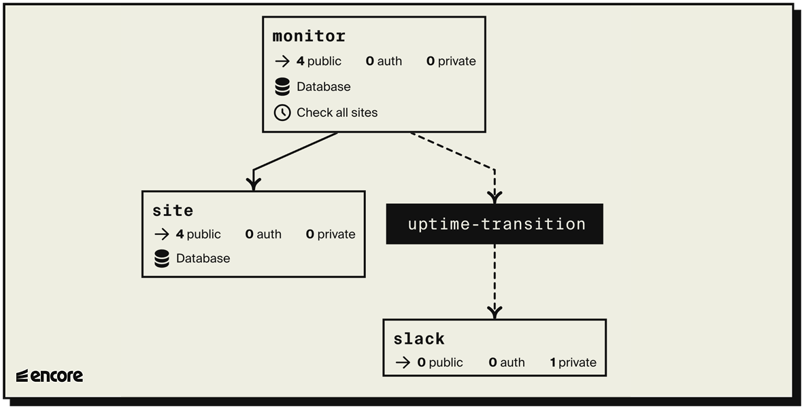

# Uptime Monitoring System

This is a Site application that continuously monitors the uptime of a list of websites.

When it detects a website going down it posts a Slack message notifying that the website is down, and another message when the website is back up again.





## Install

You will need the [Encore CLI](https://encore.dev/docs/install)
to run and deploy this application.

## Using the API

```bash
# Check if a given site is up (defaults to 'https://' if left out)
$ curl 'http://localhost:4000/ping/google.com'

# Add a site to be automatically pinged every 5 minutes
curl 'http://localhost:4000/site' -d '{"url":"google.com"}'

# Check all tracked sites immediately
curl -X POST 'http://localhost:4000/checkall'

# Get the current status of all tracked sites
curl 'http://localhost:4000/sites'
```

## Deployment

```bash
encore app create my-oncall-app-name
git push origin main
```

## Testing

```bash
encore test ./...
```